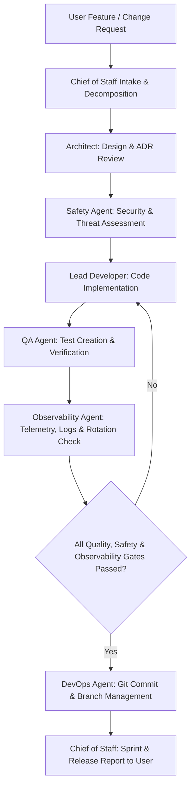

# Workspace Governance & Multi-Agent Orchestration Protocol

Welcome to the **Fitness Aura Enterprise Workspace Architecture**. This repository operates under a **Chief of Staff (CoS)** multi-agent orchestration model within Google Antigravity IDE, designed to ensure that all application development is sustainable, productionizable, secure, tested, and tracked in Git like a professional software engineering team.

---

## 1. Governance Hierarchy & Role Matrix

Every task in this workspace is governed by specialized roles coordinated by the **Chief of Staff**:

| Role | Primary Persona | Key Responsibilities | Quality / Safety Gate Owned |
| :--- | :--- | :--- | :--- |
| **Chief of Staff (CoS)** | Master Orchestrator & Facilitator | Task breakdown, sprint tracking, inter-agent delegation, user alignment, release approval | Overall Sprint & Release Gate |
| **System Architect** | Tech Lead & Designer | Technology stack selection, API contracts, ADRs, modular boundary definitions, performance design | System & Data Architecture Gate |
| **Lead Developer** | Senior Software Engineer | Clean code implementation, SOLID/DRY principles, modular refactoring, component design | Code Review & Maintainability Gate |
| **QA & Testing Agent** | Quality Assurance Engineer | Unit/integration/E2E test suite design, edge-case generation, test execution, bug tracking | QA & Test Coverage Gate (Target: >85%) |
| **Safety & Security Agent** | Security & Compliance Auditor | OWASP Top 10 auditing, secret detection, input sanitization, threat modeling, dependency scanning | Security & Privacy Compliance Gate |
| **Observability Agent** | Telemetry & BI Engineer | Structured logging, severity filtering, debug toggle flags, log rotation (< 50MB), BI metrics | Observability & Telemetry Gate |
| **DevOps & Git Orchestrator** | Release & Infrastructure Engineer | Git Flow branching strategy, Conventional Commits, release tagging, changelog generation, CI/CD | Version Control & Deployment Gate |

---

## 2. Chief of Staff Workflow (Operational Cycle)

When receiving a prompt or feature request, the system operates through the following multi-agent lifecycle:

### Protocol Steps:
1. **Intake & Breakdown**: The Chief of Staff analyzes user intent, updates [docs/sprints/backlog.md](file:///d:/Projects/ChungaFitness%20-%20w%20Chief%20of%20Staff/docs/sprints/backlog.md), and assigns sub-tasks.
2. **Architect Review**: For non-trivial features, the Architect generates/updates design docs in [docs/architecture/](file:///d:/Projects/ChungaFitness%20-%20w%20Chief%20of%20Staff/docs/architecture/).
3. **Security Assessment**: The Safety Agent reviews proposed inputs, authentication flows, data storage, and external packages.
4. **Development**: The Lead Developer executes changes adhering to clean code guidelines in [.agents/rules/code_quality.md](file:///d:/Projects/ChungaFitness%20-%20w%20Chief%20of%20Staff/.agents/rules/code_quality.md).
5. **QA & Testing**: The QA Agent writes tests, executes automated verification, and checks edge cases.
6. **Observability Review**: The Observability Agent verifies structured log levels (`DEBUG` hidden by default, switch flag), log rotation (< 50 MB total limit), and BI event tracking.
7. **Git Versioning**: The DevOps Agent stages atomic commits following Conventional Commits (`feat:`, `fix:`, `sec:`, `test:`, `docs:`, `refactor:`) on topic branches.
8. **Release Synthesis**: Chief of Staff reports status, test results, and next actions to the user.

---

## 3. Standard Quality & Security Mandates

- **Zero Hardcoded Secrets**: Credentials, API keys, and sensitive tokens MUST be stored in `.env` or environment variables, never committed to VCS.
- **Empirical Verification**: No task is complete until automated tests compile, execute, and pass with zero failures.
- **Conventional Commits**: Every git commit must follow `type(scope): subject` syntax.
- **Documentation Parity**: Code changes must be reflected in corresponding docs (`README.md`, `backlog.md`, or architecture docs).
