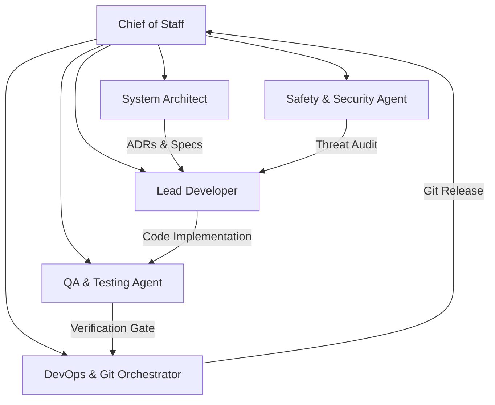

# Fitness Aura - Chief of Staff Multi-Agent Workspace

Welcome to **Fitness Aura**, built using a **Chief of Staff (CoS) Multi-Agent Workspace Architecture** within Google Antigravity IDE. This setup simulates an enterprise software development team, ensuring our app is sustainable, productionizable, secure, well-tested, and tracked with Git version control.

---

## 🏛 Multi-Agent Orchestration Team



### Agent Roles & Personas
1. **Chief of Staff (CoS)** ([.agents/roles/chief_of_staff.md](file:///d:/Projects/ChungaFitness%20-%20w%20Chief%20of%20Staff/.agents/roles/chief_of_staff.md)): Primary liaison and sprint orchestrator. Manages backlogs and delegates work to specialist agents.
2. **System Architect** ([.agents/roles/architect.md](file:///d:/Projects/ChungaFitness%20-%20w%20Chief%20of%20Staff/.agents/roles/architect.md)): System boundaries, data schemas, tech stack design, and ADRs.
3. **Lead Developer** ([.agents/roles/lead_developer.md](file:///d:/Projects/ChungaFitness%20-%20w%20Chief%20of%20Staff/.agents/roles/lead_developer.md)): Clean code implementation adhering to DRY/SOLID principles.
4. **QA & Testing Agent** ([.agents/roles/qa_agent.md](file:///d:/Projects/ChungaFitness%20-%20w%20Chief%20of%20Staff/.agents/roles/qa_agent.md)): Comprehensive test suite generation, edge-case validation, and empirical pass verification.
5. **Safety & Security Agent** ([.agents/roles/safety_security_agent.md](file:///d:/Projects/ChungaFitness%20-%20w%20Chief%20of%20Staff/.agents/roles/safety_security_agent.md)): Vulnerability scanning, secret isolation, input sanitization, and OWASP compliance.
6. **DevOps & Git Orchestrator** ([.agents/roles/devops_git_agent.md](file:///d:/Projects/ChungaFitness%20-%20w%20Chief%20of%20Staff/.agents/roles/devops_git_agent.md)): Git Flow branching strategy, Conventional Commit conventions (`feat:`, `fix:`, `sec:`), and release management.

---

## 📁 Workspace Layout

```text
ChungaFitness - w Chief of Staff/
├── .agents/                        # Multi-Agent Governance & Infrastructure
│   ├── AGENTS.md                   # Primary Workspace Protocol & Governance
│   ├── roles/                      # Detailed Persona Specifications
│   ├── skills/                     # Workspace Execution Runbooks
│   └── rules/                      # Governance Guidelines (Code Quality, Security, QA, Git)
├── docs/                           # Enterprise Documentation Suite
│   ├── architecture/               # System Design & Architecture Decision Records (ADRs)
│   ├── sprints/                    # Backlog, Kanban Board & Release Changelogs
│   └── quality_security/           # QA Checklists & Threat Matrix
├── .gitignore                      # Standard Enterprise Git Exclusions
└── README.md                       # Workspace Operating Blueprint
```

---

## ⚡ Governance & Workflow

Every feature implementation follows a strict 7-stage quality and safety lifecycle:
1. **Intake & Breakdown** by Chief of Staff ([docs/sprints/backlog.md](file:///d:/Projects/ChungaFitness%20-%20w%20Chief%20of%20Staff/docs/sprints/backlog.md))
2. **Architecture Review & ADR Creation** ([docs/architecture/](file:///d:/Projects/ChungaFitness%20-%20w%20Chief%20of%20Staff/docs/architecture/))
3. **Safety & Security Assessment** ([docs/quality_security/SECURITY_THREAT_MODEL.md](file:///d:/Projects/ChungaFitness%20-%20w%20Chief%20of%20Staff/docs/quality_security/SECURITY_THREAT_MODEL.md))
4. **Clean Code Implementation** ([.agents/rules/code_quality.md](file:///d:/Projects/ChungaFitness%20-%20w%20Chief%20of%20Staff/.agents/rules/code_quality.md))
5. **Automated Testing & Coverage Sign-off** ([docs/quality_security/QA_CHECKLIST.md](file:///d:/Projects/ChungaFitness%20-%20w%20Chief%20of%20Staff/docs/quality_security/QA_CHECKLIST.md))
6. **DevOps Git Staging & Conventional Commit** ([.agents/rules/git_version_control.md](file:///d:/Projects/ChungaFitness%20-%20w%20Chief%20of%20Staff/.agents/rules/git_version_control.md))
7. **Chief of Staff Release Report**
