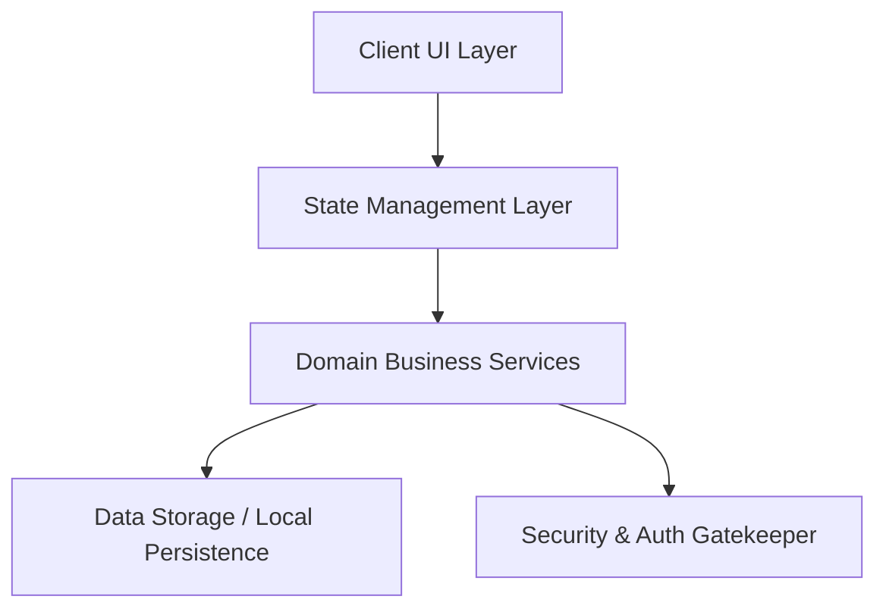

# System Architecture & Tech Stack Template

## 1. System Overview
- **App Name**: Fitness Aura
- **Mission**: Sustainable, production-grade fitness application built with Chief of Staff multi-agent orchestration within Google Antigravity IDE.
- **Target Platform(s)**: To be selected during app requirement intake.

## 2. Technology Stack & Framework Choices
- **Frontend / Client**: Pending Architect evaluation
- **Backend / Services**: Pending Architect evaluation
- **Database / Storage**: Pending Architect evaluation
- **State Management**: Pending Architect evaluation

## 3. High-Level Modular Diagram

