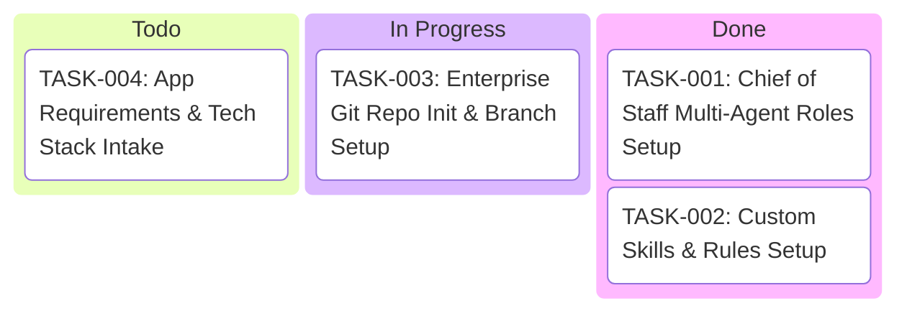

# Sprint Kanban Board

## Sprint 0: Multi-Agent Workspace Initialization

```mermaid
kanban
  Todo
    [TASK-004: App Requirements & Tech Stack Intake]
  In Progress
    [TASK-003: Enterprise Git Repo Init & Branch Setup]
  Done
    [TASK-001: Chief of Staff Multi-Agent Roles Setup]
    [TASK-002: Custom Skills & Rules Setup]
```
